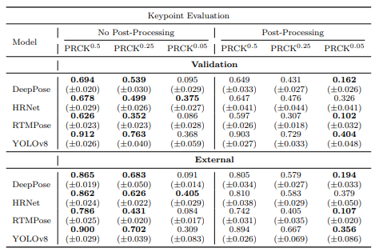
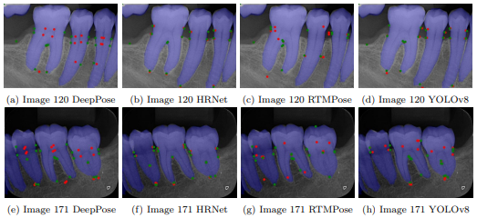

# Periodontal Bone Loss Analysis via Keypoint Detection With Heuristic Post-Processing

This code accompanies the paper "Periodontal Bone Loss Analysis via Keypoint Detection With Heuristic Post-Processing" [Paper](https://arxiv.org/abs/2503.13477)


Please follow the instructions in Train_and_Eval.ipynb or follow this readme.


## Overview

This code can be used with any baseline landmark/pose estimation model, the baseline model used is YOLOv8n-pose, contributions are in the dental imaging specific post processing module.

### Abstract


Objectives: This study proposes a deep learning framework and annotation methodology for the automatic detection of periodontal bone loss landmarks, associated conditions, and staging.

Methods: 192 periapical radiographs were collected and annotated with a stage agnostic methodology, labelling clinically relevant landmarks regardless of disease presence or extent. We propose a heuristic post-processing module that aligns predicted keypoints to tooth boundaries using an auxiliary instance segmentation model. An evaluation metric, Percentage of Relative Correct Keypoints (PRCK), is proposed to capture keypoint performance in dental imaging domains. Four donor pose estimation models were adapted with fine-tuning for our keypoint problem.

Results: Post-processing improved fine-grained localisation, raising average P RCK0.05 by +0.028, but reduced coarse performance for P RCK0.25 by −0.0523 and P RCK0.5 by −0.0345. Orientation estimation shows excellent performance for auxiliary segmentation when filtered with either stage 1 object detection model. Periodontal staging was detected sufficiently, with the best mesial and distal Dice scores of 0.508 and 0.489, while furcation involvement and widened periodontal ligament space tasks remained challenging due to scarce positive samples. Scalability is implied with similar validation and external set performance.

Conclusion: The annotation methodology enables stage agnostic training with balanced representation across disease severities for some detection tasks. The P RCK metric provides a domain-specific alternative to generic pose metrics, while the heuristic post-processing module consistently corrected implausible predictions with occasional catastrophic failures. Clinical significance: The proposed framework demonstrates the feasibility of clinically interpretable periodontal bone loss assessment, with potential to reduce diagnostic variability and clinician workload.


### Quantitative Results

<p align="center">
	 <br />
	<em>
		Figure 1: Table containing PRCK keypoint results for all models, with and without postprocessing, for the validation and external sets, at thresholds 0.5, 0.25, and 0.05. Results are reported as mean(±standard deviation), where standard deviation is calculated over 5-folds.
	</em>
</p>


### Qualitative Results

<p align="center">
	 <br />
	<em>
		 Figure 2: Six validation images with overlay keypoint results, where red points are the raw keypoint predictions and green points are the post-processed keypoints.
	</em>
</p>


## Usage


+ Clone the repository and navigate to new directory:

```
git clone https://github.com/Banksylel/H-FCBFormer
cd ./H-FCBFormer
```


+ Install requirements:

```
pip install -r requirements.txt
```


+ Install the used version or the latest version of pytorch (with appropriate CUDA version for your device):

```
pip install torch torchvision torchaudio --index-url https://download.pytorch.org/whl/cu118
```

or

[Pytorch](https://pytorch.org/get-started/locally/)


+ Download the base YOLO weights (for reproducing training results) and save to project base folder:

[Base YOLO Weights](https://drive.google.com/drive/folders/1VrggZSB75hKWMz9bER5zxjaTaaBJBaYJ?usp=sharing)

+ Download our fine tuned weights (for inference tasks or further fine tuning) and save to base folder/runs:

[Fine-tuned Weights](https://drive.google.com/drive/folders/1iCj5N4QDv8vjkzt4EsSuRSGnluLMGDhQ?usp=sharing)

+ Request access to the dataset (non-commercial purposes only):

[Dataset](https://zenodo.org/records/17272200)


### IMPORTANT: Change config files to match your dataset file location

Under ultralytics/cfg/datasets change [YOUR DATASET DIRECTORY] to match the file location of the downloaded dataset (for all config files). Files to change start with CUSTOM_.


### Training

Run this to train the model

```
python Train_Model.py ----code-directory="[code directory]" --folds="5" --epochs="200" --image-size="640" --output-csv="training_results.csv"

```
+ Replace `[code directory]` with the full file path to the repo on your device.


### Evaluation

Run this to evaluate and save quantitative results to a specified location

```
python Eval_Model.py ----code-directory="[code directory]" --dataset-dir-standard="[dataset directory]/1_Experiment/standard_box" --dataset-dir-rotate="[dataset directory]/1_Experiment/rotating_box" --fold-folder-nme="fold" --save-loc="[code directory]/runs/val_results" --test-set="False" --post-process-kpts="True" --image-size="640" --folds="5" --view-images="False" --include-fp-fn-nme="True" --include-fp-fn-prck="True" --non-max-merge-thresh="0.1" --pred-seg-iou="0.70" --pred-seg-conf="0.15" --pred-kpts-iou="0.3" --pred-kpts-conf="0.48" --furcation-dist-thresh="0.05"
```
+ Replace `[code directory]` with the full file path to the repo on your device.
+ Replace `[dataset directory]` with the full file path to the base dataset folder.

```
--code-directory - full file path to this repo on your device 
--dataset-dir-standard - full file path to the dataset subfolder for the keypoint detection subfolder
--dataset-dir-rotate - full file path to the dataset subfolder for the rotation only bounding boxes
--fold-folder-nme - name of the saved weights location from training within the "runs" subfolder (defaulted to fold)
--save-loc - save location for evaulation results
--test-set - indicates if the evaulation is for the validation set (False) (5 fold models evaluated on 5 separate validation sets) or for the test set (True) (5 fold models evaluated on the same test set)
--post-process-kpts - indicates if the results should be post processed (True) or not (False)
--image-size - indicates the image size for evaluation (640 default/training size)
--folds - indicates the number of folds to evaluate
--view-images - view images (saved and while running)
--non-max-merge-thresh - threshold for non maximum merging
--pred-seg-iou - predicted tooth segmentation model iou threshold
--pred-seg-conf - predicted tooth segmentation model confidence threshold 
--pred-kpts-iou - predicted keypoint model iou threshold
--pred-kpts-conf - predicted keypoint model confidence threshold
--furcation-dist-thresh - furcation involvement indicator threshold (distance from furcation keypoints groups to consider the furcation area involved)
```


### Inference/Predict

Run this to save qualitative inference results 

```
----code-directory="[code directory]" --dataset-dir-standard="[dataset directory]/1_Experiment/standard_box" --weight-file="[code directory]/runs/pose/fold/train3/weights/best.pt" --seg-weights="[code directory]/runs/segment/train/weights/best.pt" --save-loc="[code directory]/runs/kpt_pred" --post-process-kpts="True" --ignore-box-classes="[0,1,2]" --image-size="640" --non-max-merge-thresh="0.1" --pred-seg-iou="0.70" --pred-seg-conf="0.15" --pred-kpts-iou="0.3" --pred-kpts-conf="0.48" --furcation-dist-thresh="0.05"
```

```
--ignore-box-classes - does not plot these specified class numbers for bounding box classes (defaulted to 0 - single root teeth, 1 - double root teeth, and 2 - triple root teeth)
```


